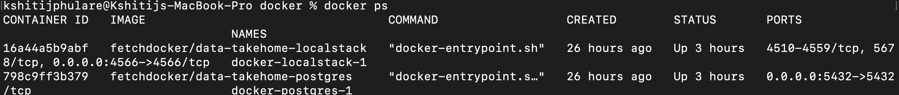
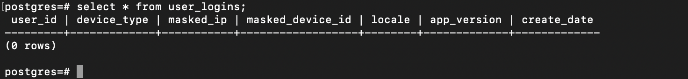
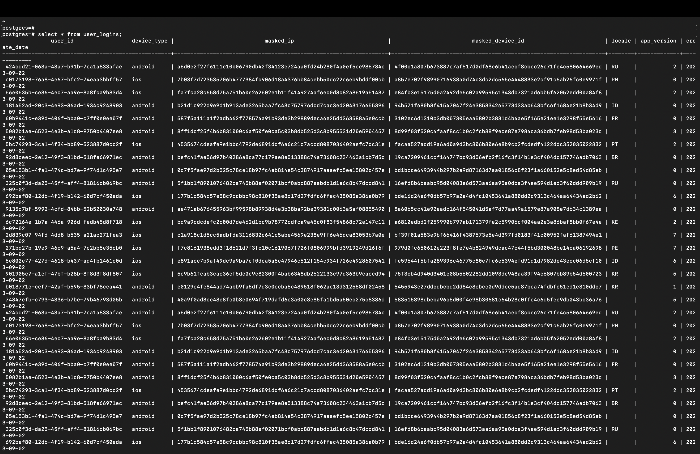
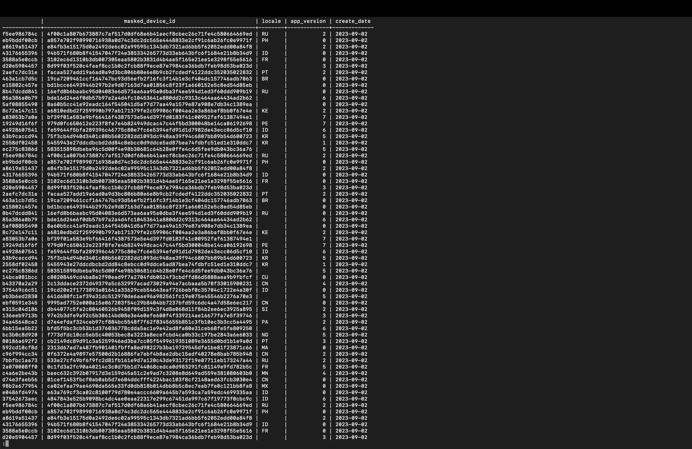

# Fetch_Rewards_DataEngineer
## Summary of the Code
The Python program periodically polls the SQS queue, fetches the JSON data from it in small batches, performs data cleaning to get the data into the required format and then finally puts the data into the Postgres table

## Running the code
```
  git clone https://github.com/Kshitij6798/Fetch_Rewards_DataEngineer.git

  cd docker
```
  After navigating to the docker folder, compose the docker.yaml file using the command below
  
```
  docker compose up -d
```

The two docker files should then be up and running. You can verify that by running the following command
```
docker ps
```

This is how it looks



Come back to the projects folder, install the necessary requirements, and run the main file
```
  pip3 install -r requirements.txt

  python3 main.py

```

For checking the final results, we need to connect to postgres and fetch data from the user login table using the commands below
```
psql -d postgres -U postgres -p 5432 -h localhost -W


select * from user_logins;
```

The below screenshots show the table before and after running the code



Results





Provision infrastructure in a cloud environment, configure databases, and secure sensitive data.
Use CI/CD for code deployment, monitoring, and auto-scaling.
Implement robust error handling, security measures, and disaster recovery.
Continuously monitor, optimize, and document the deployment while adhering to compliance and regulations.


# Questions
### How would you deploy this application in production?
To deploy it to production, we first need to provision some sort of cloud environment like AWS or Google Cloud. This would be followed up by configuring the databases and securing the sensitive data. CI/CD needs to be set up for deployment, monitoring, and scaling. At the same time Error handling and disaster recovery is also something I would have to consider

### What other components would you want to add to make this production-ready?
Kafka is something which could be used. Also different AWS accounts would need to be provisioned. Logging and Monitoring could be improved using something like Grafana which would help in analyzing and monitoring the application in detail

### How can this application scale with a growing dataset.
Stream Processing FrameWorks could help. At the same time Load Balancers could be used to ensure that all processing nodes are being worked evenly

### How can PII be recovered later on?
A proper encryption algorithm can be used in the future like AES-256 or RSA, which would help in decrypting the Encrypted text but only using the decryption key which should be kept safe and secure

### What are the assumptions you made?
I have used SHA-256 for masking the PII data which is a cryptographic hash function. So it is not possible to directly decrypt the masked data. The Incoming input could be hashed and the hash value could be compared to the masked value stored in the database to check if it matches, but there is no way to directly retrieve the original input. In future, as I stated above, if needed we could use a proper encryption algorithm so that the data could be retrieved if needed
I have also set a limit on the number of bad messages. The limit is configurable. If the number of bad messages exceed a certain number, I am terminating the program. The logic is that there must be some corrupted value in the queue which is causing these high number of error messages and thus the system needs to be checked


# Design
### How will you read messages from the queue?
I have used boto3 to connect to the SQS and read messages from the queue. The number of messages to be read can be passed to the batch_size parameter and the wait_time specifies the time for which the SQS will be polled for new messages

### What type of data structures should be used?
I have used the queue data structure to read the messages from the SQS and then iterated over the queue to process each message individually. I have also kept a separate queue for handling bad messages, where the data seems to be corrupt. If the length of this queue passes a certain threshold, the program is terminated

### How will you mask the PII data so that duplicate values can be identified?
Masked the Data using SHA256. The same hash value will be generated if the input is the same. This will help in identifying the duplicates

### What will be your strategy for connecting and writing to Postgres?
I have used the psycopg2 which is like a python adapter for connecting to PostgreSQL. Everytime I get messages in my message queue, I am iterating over the entire queue, cleaning each message, masking the PII fields and then inserting the fetched values into a query template which is written to PostgreSQL using psycopg2. This code is present in the db module

```
def insert_query(conn, user_login_dict):
    try:
        insert_query = """
        INSERT INTO user_logins (user_id, device_type, masked_ip, masked_device_id, locale, app_version, create_date)
        VALUES (%s, %s, %s, %s, %s, %s, %s)
        """
        data = (
            user_login_dict["user_id"],
            user_login_dict["device_type"],
            user_login_dict["masked_ip"],
            user_login_dict["masked_device_id"],
            user_login_dict["locale"],
            user_login_dict["app_version"],
            user_login_dict["create_date"]
        )
        with conn, conn.cursor() as cursor:
            cursor.execute(insert_query, data)
        return 0
    except Exception as e:
        return 1
```

### Where and how will your application run?
As a Python Program currently
